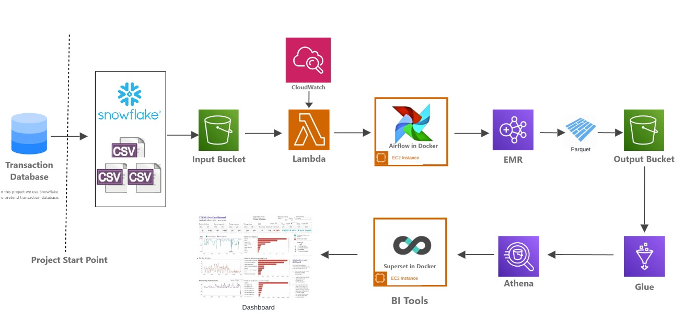
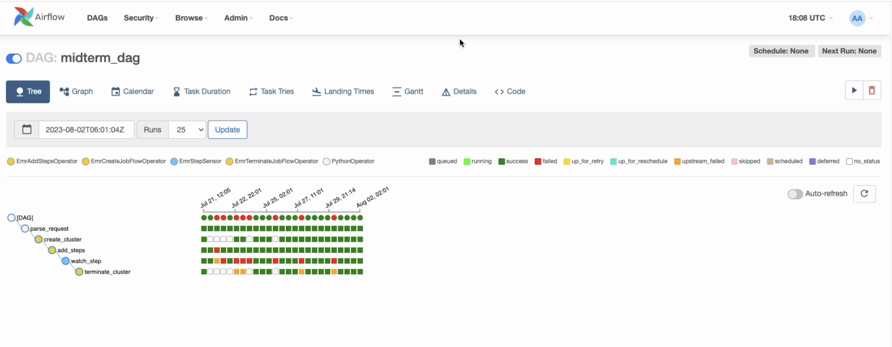
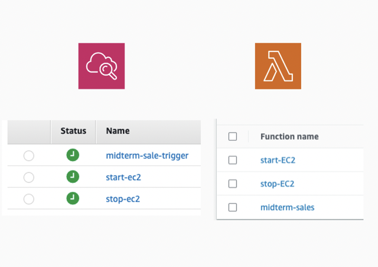
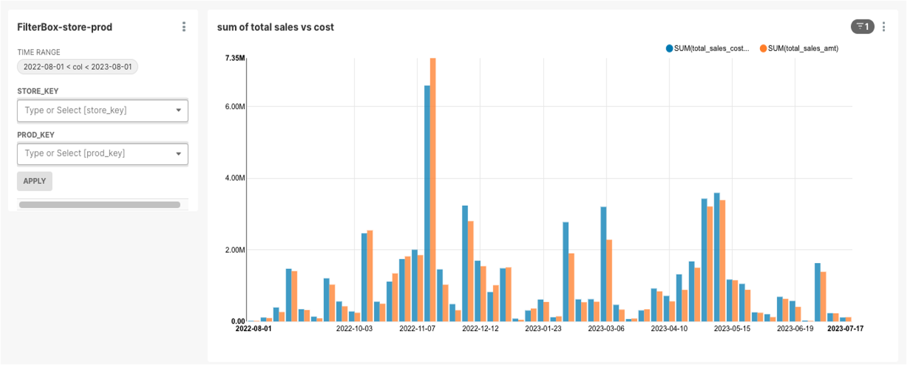

# ETL Sales Data Pipeline with Airflow

## Table of Contents
- [Overview](#overview)
- [Architecture](#architecture)
- [Daily Workflow](#daily-workflow)
- [Installation and Setup](#installation-and-setup)
  - [Prerequisites](#prerequisites)
  - [Setup](#setup)
- [Usage](#usage)

## Overview

This project emulates a typical ETL process found in many companies where data files are sent daily to a data lake, then scanned and processed for further analysis. In this guide, you'll create an ETL (Extract/Transform/Load) data pipeline from data ingestion to a BI dashboard output using Apache Airflow for orchestration. The pipeline processes daily sales and inventory transactional tables sourced from a relational database. The transformed data is then stored in an S3 data warehouse and finally read into a BI dashboard. This entire pipeline is set to run daily at 2am UTC.
To understand the data transformations and the metrics derived from the processed data, refer to the [SalesDataMetrics Document](./SalesDataMetrics/metrics_document.md) housed in the `metrics` folder.

## Architecture

The architecture leverages primarily AWS services, with a focus on a cost-effective and scalable approach:

- **Data Source**: Daily sales and inventory data from an OLTP database (e.g., Snowflake) are formatted as CSV files.
- **AWS S3**: Acts as our data lake storage. It holds both the input transactional tables and the transformed data.
- **Apache Airflow**: Orchestrates the ETL workflow.
- **AWS EC2**: Hosts the Airflow instance.
- **AWS CloudWatch**: Scheduled to trigger the EC2 start and stop actions and initiate the ETL pipeline daily at 2am UTC.
- **AWS Lambda**: Validates the incoming data files in S3 and controls the EC2 instance's state.
- **AWS EMR & Spark**: Processes and transforms the data.
- **AWS Glue & Athena**: Acts as our serverless data warehouse solution.
- **Superset**: Provides a Business Intelligence dashboard for visualizing and analyzing the transformed data.

## Daily Workflow:

1. At 2am UTC, the OLTP database (e.g., Snowflake) sends CSV-formatted transactional data tables to an S3 bucket.
2. AWS CloudWatch triggers the start of the EC2 instance that hosts our Airflow application.
3. Once the EC2 instance is up, AWS CloudWatch triggers our Lambda function to:
   - Validate the input files in S3.
   - Start the Airflow DAG if validation passes.
4. The Airflow DAG processes the data through several stages, from extraction to loading. 

5. After the DAG execution, CloudWatch triggers the Lambda function to stop the EC2 instance to save costs.
  
## Installation and Setup

### Prerequisites
Before starting the installation, ensure you have:

- AWS Account with necessary access privileges.
- Snowflake Account.
- Docker (for Superset and Airflow).
- Apache Airflow and Apache Superset installed on an EC2 instance (Ubuntu).

### 1. Setting Up S3 Bucket

- Navigate to the S3 service on AWS Console.
- Create a new bucket.
- Set permissions.

### Bucket Folder Structure
Ensure that your S3 bucket contains the following folders:
- `emr-logs`
- `artifacts`
- `data-dump`
- `result`
- `superset-stage`

These folders serve distinct purposes and are crucial for the seamless execution of the subsequent steps in the setup.

### 2. EC2 Instance Setup

To set up the EC2 instance:
- Create an instance with Ubuntu.
- SSH into the instance.
- Update the OS and install necessary dependencies.
- Install and configure Airflow.
- Set up the Airflow web server and scheduler.

### 3. Lambda Function

For the Lambda function:
- Navigate to the Lambda service in AWS Console.
- Create a new function with a relevant name.
- Ensure the function has permissions to access S3 and EC2 services.
- Add the code to validate S3 file presence and integrity.
- Add code to control the EC2 instance state.

### 4. CloudWatch Alarms and Scheduling
To set up CloudWatch:
- Navigate to CloudWatch on AWS Console.
- Create an event rule to start the EC2 instance daily at 2am UTC.
- Create another event rule to trigger the Lambda function once EC2 is operational.
- Optionally, create an alarm to stop EC2 after the Airflow DAG completes, optimizing costs.

### 5. Airflow DAG Setup
To set up the Airflow DAG:
- Install Airflow via Docker on the EC2 instance.
- Place the provided Python code in the `dags` folder.
- Activate the DAG in the Airflow UI.

### 6. AWS EMR & Spark Configuration
Although the setup and management of the EMR cluster, as well as the execution of Spark jobs, are handled automatically by the Airflow DAG, it's important to understand their roles:

- **EMR Cluster**: A managed cluster platform that simplifies running big data frameworks, such as Apache Spark and Apache Hadoop. In this setup, the cluster is automatically created, used, and terminated by the Airflow DAG.
  
- **Spark**: A fast, in-memory data processing engine with elegant and expressive development APIs. The provided Airflow DAG code handles the Spark job submission on the EMR cluster.

### 7. AWS Glue & Athena
To set up AWS Glue & Athena:
- Navigate to AWS Glue and create a new Crawler.
- Configure the Crawler to access your S3 data location.
- Let the Crawler identify data schema and create tables.
- In Athena, run SQL-like queries against these tables for verification.

### 8. Superset Installation

To set up Superset:
- On your EC2 instance, install Superset using Docker.
- Follow Superset's documentation to initiate the application.
- Connect Superset to Athena using Athena's JDBC connector.
- Design your dashboards and visualizations using the available data.

## Usage
- Initiate the ETL process via Airflow.
- Through the Airflow UI, you can manage and monitor ETL tasks.
- After processing and loading the data, leverage Apache Superset to design and view various dashboards and reports.
